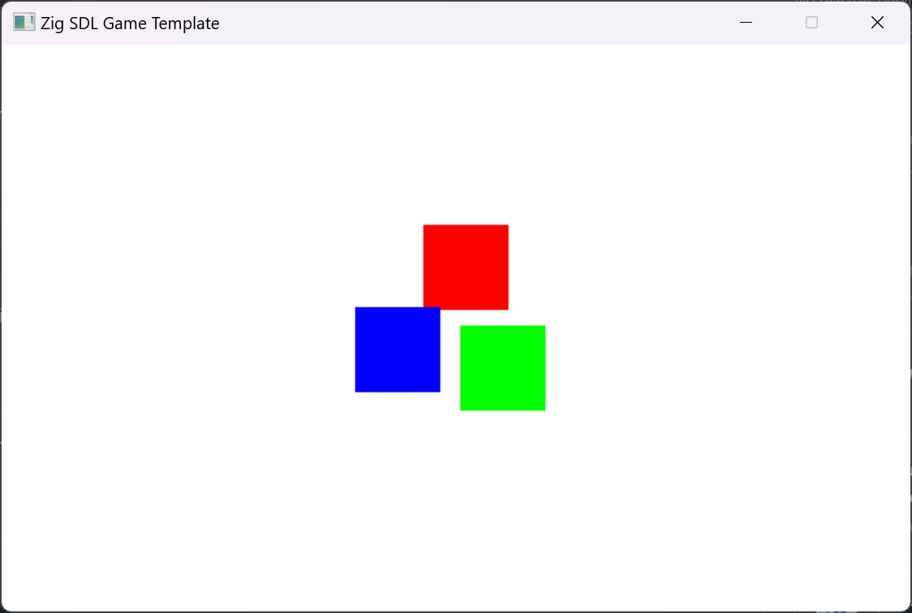

# Zig SDL Game Template
An empty Zig project configured with the SDL library as a starting point for Zig game development. The full Zig project is included in this repo.

## Zig Build Version
This project was built against Zig version "zig-windows-x86_64-0.14.0-dev.1588+2111f4c38" and SDL version "SDL2-2.30.2".

## Developers
Victor Brusca
 
Carlo Bruscani

## Based On
This template was based on an older tutorial, [Zig For Game Dev](https://dev.to/fabioarnold/setup-zig-for-gamedev-2bmf), and updated to work with the current version of Zig.

## Execution Example
Running the executable, "zig-out\bin," after a project build, "zig build," results in the following basic SDL demonstration window. Tested only on Windows 11.
  

